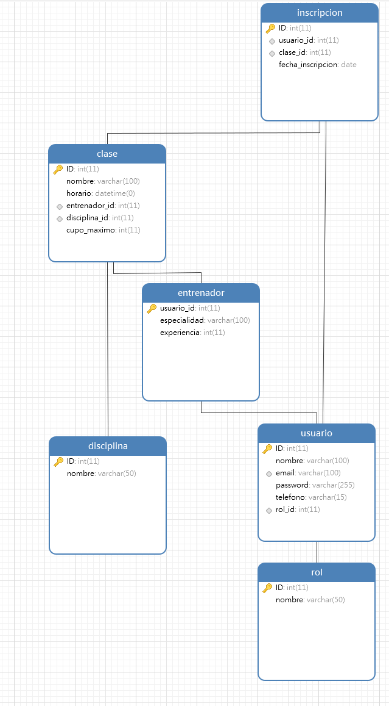

# 📚 GymBook - README

¡Bienvenidos a **GymBook**! 🎉 Esta es una aplicación diseñada para gestionar tu gimnasio de manera eficiente y sencilla. A continuación, encontrarás toda la información necesaria para comenzar a usarla.

## 🚀 Características

- **Registro de Usuarios**: Permite a los usuarios registrarse y gestionar su información personal. 📝
- **Clases y Entrenadores**: Visualiza las clases disponibles y los entrenadores asignados. 🏋️‍♂️
- **Inscripciones**: Los usuarios pueden inscribirse en las clases de su elección. 📅
- **Gestión de Roles**: Administra diferentes roles de usuario (administrador, entrenador, etc.). 👥
- **Configuración de Notificaciones**: Personaliza las preferencias de notificación. 🔔
- **Modo Oscuro**: Cambia a un tema oscuro para una mejor experiencia visual. 🌙

## 📦 Instalación

Para instalar y ejecutar la aplicación, sigue estos pasos:

1. **Clona el repositorio**:
   ```bash
   git clone https://github.com/tu_usuario/GymBook.git
   ```

2. **Navega al directorio del proyecto**:
   ```bash
   cd GymBook
   ```

3. **Instala las dependencias**:
   ```bash
   mvn install
   ```

4. **Ejecuta la aplicación**:
   ```bash
   mvn spring-boot:run
   ```

5. **Accede a la aplicación**: Abre tu navegador y dirígete a `http://localhost:8080`. 🌐

## 🛠️ Tecnologías Utilizadas

- **Backend**: 
  - Java
  - Spring Boot
  - JPA (Java Persistence API)
  - MySQL

- **Frontend**: 
  - React
  - Axios para las solicitudes HTTP

## 📖 Uso

1. **Registro de Usuario**: Dirígete a la página de registro y completa el formulario. 
2. **Iniciar Sesión**: Usa tus credenciales para acceder a tu cuenta. 🔑
3. **Reservar Clases**: Navega a la sección de clases y selecciona la que deseas reservar. 
4. **Configuración**: Ajusta tus preferencias en la sección de configuración. ⚙️

## 🧪 Pruebas

### Postman

*Esta sección se completará más adelante con ejemplos de pruebas realizadas con Postman.*
Esperamos que disfrutes de la aplicación y que te ayude a gestionar tu gimnasio de manera efectiva. ¡Mantente en forma! 💪
## 📊 Base de Datos

*La estructura de la base de datos se puede visualizar en el siguiente diagrama:*

  <!-- añadir imagen de la bd -->

## 🎥 Video de Funcionamiento

*Puedes ver un video de cómo funciona la aplicación aquí:*

[Ver Video](https://www.youtube.com/watch?v=tu_video)  <!-- video -->

## 🤝 Contribuciones

¡Las contribuciones son bienvenidas! Si deseas contribuir, por favor sigue estos pasos:

1. Haz un fork del proyecto.
2. Crea una nueva rama (`git checkout -b feature/nueva-caracteristica`).
3. Realiza tus cambios y haz un commit (`git commit -m 'Añadir nueva característica'`).
4. Envía un pull request.

## 📞 Contacto

Si tienes alguna pregunta o sugerencia, no dudes en contactarme:

- **GitHub**: [ClaudiaCalero](https://github.com/ClaudiaCalero)
- **GitHub**: [tu_usuario](https://github.com/tu_usuario)
- **GitHub**: [tu_usuario](https://github.com/tu_usuario)
- **GitHub**: [tu_usuario](https://github.com/tu_usuario)

## 👥 Personas Implicadas

- **Clàudia Calero Duró** - [LinkedIn](https://www.linkedin.com/in/claudia-calero/)
- **Nombre 2** - [LinkedIn](https://www.linkedin.com/in/tu_perfil2)
- **Nombre 3** - [LinkedIn](https://www.linkedin.com/in/tu_perfil3)
- **Nombre 4** - [LinkedIn](https://www.linkedin.com/in/tu_perfil4)

## 🎉 ¡Gracias por usar GymBook! 

